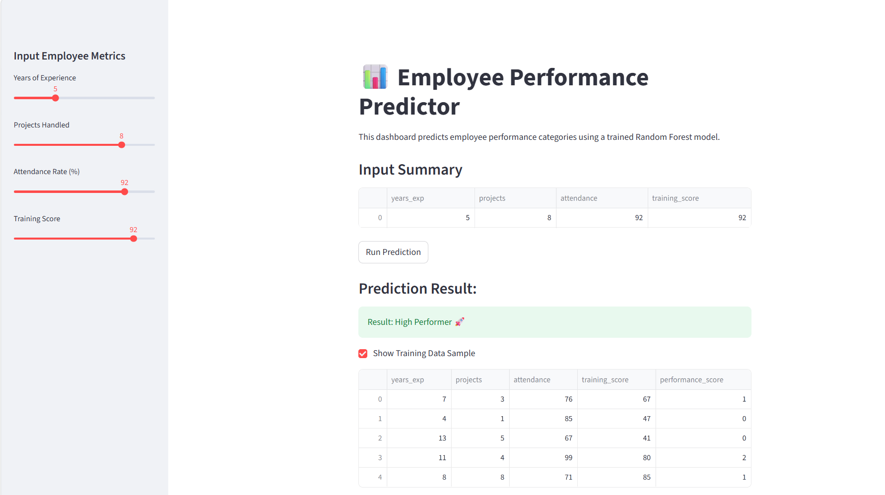
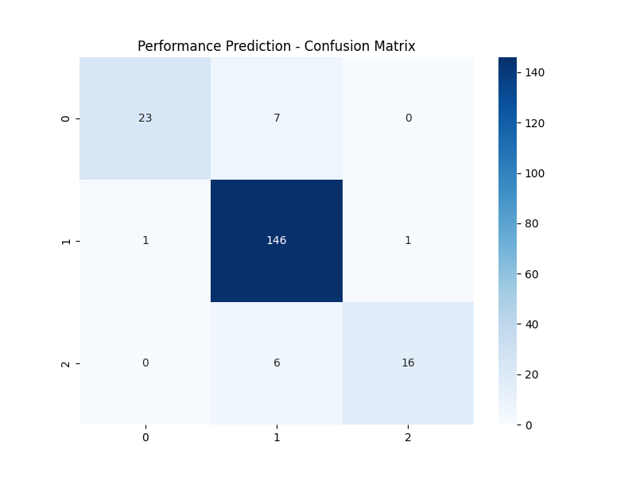
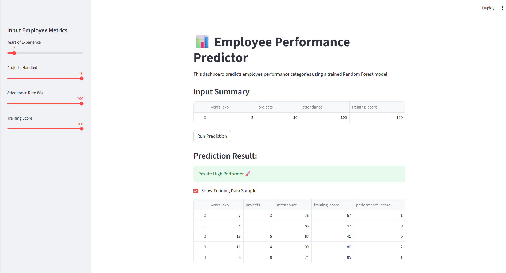

# 📊 Employee Performance Predictor using Data Analytics

This is an end-to-end Machine Learning project designed to help HR departments predict employee performance levels (High, Medium, or Low). The project includes a data generation pipeline, a machine learning model, and a web-based dashboard using Streamlit.

## 🚀 Project Overview
In a corporate environment, identifying high-performing employees and providing support to low-performers is crucial. This project automates that process using a **Random Forest Classifier** trained on key metrics like experience, project delivery, attendance, and training scores.

---

## 🛠 Tech Stack
- **Language:** Python 3.11
- **ML Libraries:** Scikit-learn, Pandas, Numpy
- **Visualization:** Matplotlib, Seaborn
- **Web Framework:** Streamlit (For the UI)
- **Environment:** Virtual Environment (venv)

---

## 📂 Project Structure
```text
Employee-Performance-Predictor/
│
├── data/               # Contains the generated employee dataset (CSV)
├── models/             # Stores the trained ML model (.pkl)
├── outputs/            # Stores performance graphs (Confusion Matrix)
├── images/             # Screenshots for documentation
├── app.py              # Streamlit Web Dashboard
├── main.py             # Model training and evaluation script
├── requirements.txt    # List of dependencies
└── README.md           # Project documentation
⚙️ Installation & Setup
Follow these steps to run the project locally:

1. Clone the Repository
Bash
git clone [https://github.com/your-username/Employee-Performance-Predictor.git](https://github.com/your-username/Employee-Performance-Predictor.git)
cd Employee-Performance-Predictor
2. Create and Activate Virtual Environment
PowerShell
# Create environment
python -m venv venv

# Activate (Windows)
.\venv\Scripts\activate
3. Install Dependencies
Bash
pip install -r requirements.txt
📈 Execution Steps
Step 1: Train the Model
Run the following command to generate synthetic data and train the AI model.

Bash
python main.py
This will create employee_data.csv, train the model, and save a result graph in the outputs/ folder.

Step 2: Launch the Web Dashboard
Run the Streamlit app to interact with the model.

Bash
streamlit run app.py

## 📊 Project Visuals

### 1. Dataset Preview


### 2. Performance Analysis (Confusion Matrix)


### 3. Streamlit Dashboard


📊 Visual Proof & Results
1. Dataset Preview
Here is a sample of the synthetic HR data used for training:

2. Model Performance
The model achieved an accuracy of 92.5% on the test set. Below is the Confusion Matrix:

3. Interactive Dashboard
Users can input metrics and get real-time performance predictions:

💡 Interview Insights
Algorithm: Used Random Forest for its ability to handle non-linear relationships and prevent overfitting.

Data: Generated Synthetic Data with specific logic to simulate real-world HR patterns.

Scalability: The system can be integrated with real SQL databases for enterprise use.

🤝 Contributing
Feel free to fork this project and submit pull requests for any improvements!

📜 License
This project is licensed under the MIT License.